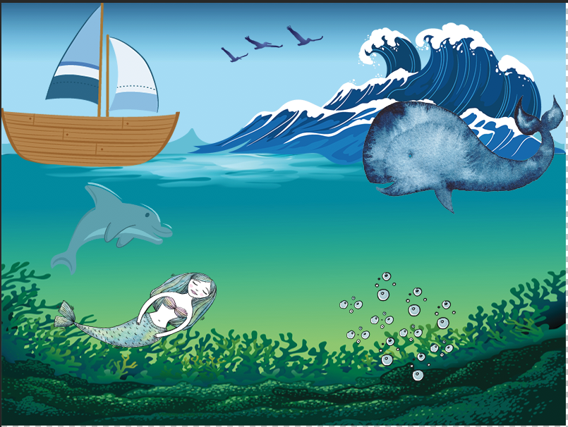

# Interactive Media Mixer with Fancy Drag & Drop!
Creating a drag and drop application with vanilla javascript, html5, and css3 using what we've learned in the duration of the semester.

## Description
🐳🐬💧🐢🐋⛵️🎶Create Soothing Ocean Waves🎶⛵️🐋🐢💧🐬🐳

An ocean themed music mixer 

## How to Play

1. Choose and icon from the eight below &amp; drag it onto the left panel
2. Music relating to the icon will start to play, and a fun illustration will     pop onto the canvas
3. A maximum of 5 icons can be used at a time
4. To empty out the canvas, press the Reset Button
5. Watch the magic unfold and enjoy 🌈 🦄 🔮

### Installing

cd to the directory of your choice, clone, and hack away!

## Authors

* Ifekitan Obasa - developer
* Nour Al-Osman - designer

## Acknowledgments/Credits
Seagull Image
<a href="https://www.freevector.com/free-birds">FreeVector.com</a>

Dolphin image credit
https://www.freepik.com/free-vector/sea-animals-collection_1125276.htm
<a href="https://www.freepik.com/free-photos-vectors/nature">Nature vector created by anggar3ind - www.freepik.com</a>
Calm waves attribution

<a href="https://www.freepik.com/free-photos-vectors/abstract">Abstract vector created by freepik - www.freepik.com</a>

Boat attribution
<a href="https://www.freepik.com/free-photos-vectors/wood">Wood vector created by freepik - www.freepik.com</a>

Ocean background - water and sky
Graphics by: <a target="_blank" href="https://www.vecteezy.com">www.Vecteezy.com</a>

Mermaid 
<a rel="nofollow" target="_blank" href="https://www.vecteezy.com">Free Vectors via Vecteezy!</a>

Seagull attribution
Vector Illustration by <a target="_blank" href="https://www.vecteezy.com/">www.Vecteezy.com</a>

